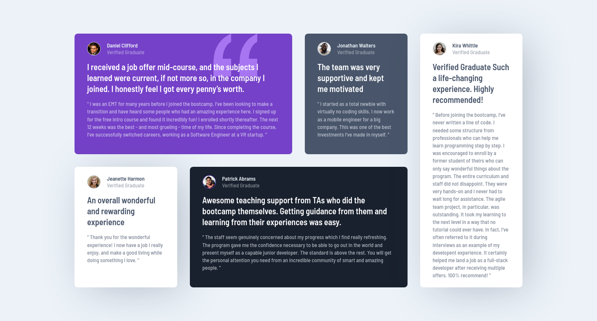

# Frontend Mentor - Testimonials grid section solution

This is a solution to the [Testimonials grid section challenge on Frontend Mentor](https://www.frontendmentor.io/challenges/testimonials-grid-section-Nnw6J7Un7). Frontend Mentor challenges help you improve your coding skills by building realistic projects. 

## Table of contents

- [Overview](#overview)
  - [The challenge](#the-challenge)
  - [Screenshot](#screenshot)
  - [Links](#links)
- [My process](#my-process)
  - [Built with](#built-with)
  - [What I learned](#what-i-learned)
  - [Continued development](#continued-development)
  - [Useful resources](#useful-resources)
- [Author](#author)

## Overview

### The challenge

Users should be able to:

- View the optimal layout for the site depending on their device's screen size

### Screenshot

### Links

- Solution URL: [Frontend Mentor Solution](https://www.frontendmentor.io/solutions/testimonials-grid-section-gUmpobz6LO)
- Live Site URL: [Testimonials grid section](https://axldev96.github.io/testimonials-grid-section/)

## My process

### Built with

- Semantic HTML5 markup
- CSS custom properties
- Flexbox
- CSS Grid
- Mobile-first workflow
- Vanilla JavaScript
- CSS Box Shadow Generator

### What I learned

In this project I mainly put into practice my knowledge about CSS Grid and Javascript with Fetch API. I decided to create a .json document to use as a database, with Javascript consuming it through etch and generating each letter from each user. Doing this seemed like it would save me a lot of time writing HTML.

### Continued development

I want to further improve my CSS skills with Grid, I also want to learn the BEM methodology for more readable and maintainable code.

### Useful resources

- [Mozilla MDN Web Docs | CSS Grid Layout](https://developer.mozilla.org/en-US/docs/Web/CSS/CSS_Grid_Layout) - This resource was very useful, it helped me understand how the radio inputs work.

## Author

- Frontend Mentor - [@axldev96](https://www.frontendmentor.io/profile/axldev96)
- Twitter - [@axldev96](https://twitter.com/axldev96)
